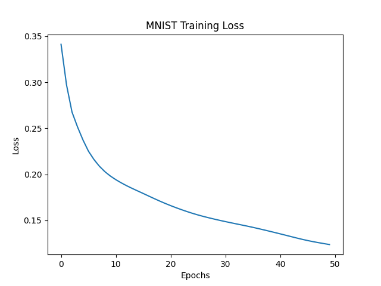
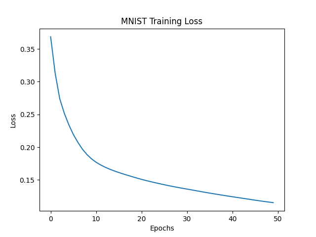

# 🧠 Neural Network From Scratch

## 📌 Overview

This project implements a **Neural Network from scratch using NumPy**, without relying on deep learning frameworks.
It demonstrates how core concepts like **forward propagation, backpropagation, and gradient descent** work internally.

The project also includes **experiments, visualizations, and a Streamlit-based interactive demo**.

---

## 🚀 Features

* Neural Network built completely from scratch
* Customizable architecture (layers, neurons, learning rate)
* Training on synthetic and real datasets
* Loss vs Epoch visualization
* Decision boundary plotting
* MNIST dataset integration (binary classification: 0 vs not 0)
* Interactive demo using Streamlit

---

## 🧪 Experiments Performed

* 📉 Learning Rate Comparison
* 🧱 Hidden Layer Size Analysis
* ⏱ Epoch Variation Study
* 🧠 MNIST Dataset Training

These experiments help understand how hyperparameters affect model performance.

---

## 📊 Tech Stack

* Python
* NumPy
* Matplotlib
* Scikit-learn
* Streamlit

---

## 📂 Project Structure

```
NeuralNetwork_from_Scratch/
│── model.py          # Neural Network implementation
│── train.py          # Experiments and training
│── utils.py          # Visualization functions
│── app.py            # Streamlit demo app
│── requirements.txt  # Dependencies
│── README.md
```

---

## ▶️ How to Run

### 1️⃣ Install dependencies

```
pip install -r requirements.txt
```

### 2️⃣ Run experiments

```
python train.py
```

### 3️⃣ Run Streamlit app

```
streamlit run app.py
```

---

### Example:

* Loss vs Epoch Graph
* Decision Boundary Visualization
* Streamlit Prediction UI

```


```

---

## 🧠 Learning Outcomes

* Deep understanding of neural network internals
* Hands-on implementation of backpropagation
* Impact of hyperparameters on training
* Working with real-world datasets (MNIST)
* Building interactive ML applications

---

## ⚠️ Limitations

* Implemented using NumPy (not optimized for large-scale training)
* MNIST is simplified to binary classification
* No GPU acceleration

---

## 🔮 Future Improvements

* Multi-class classification for MNIST
* Comparison with PyTorch/TensorFlow
* Improved UI with drawing canvas for digit input
* Performance optimizations (vectorization, batching)

---

## 📬 Author

Sthavir Punwatkar

---

## ⭐ If you like this project

Give it a star on GitHub!
